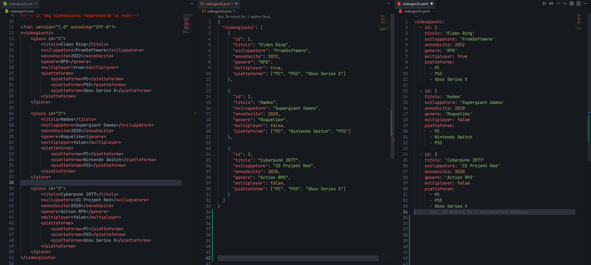

<h1 align="center">Progetto-4-XML-JSON-YAML</h1>

###

###

<h2 align="center">Progetto 4: XML | JSON | YAML</h2>

###

<h3 align="left">Il progetto:</h3>

###

Breve progetto con lo scopo di conoscere i 3 principali linguaggi o formati di serializzazione dei dati.

###

<h3 align="left">Obiettivi:</h3>

###

Lo scopo principale è quello di conoscere i formati, la loro sintassi e gli utilizzi più comuni nella programmazione

###

<h3 align="left">Passaggi svolti:</h3>

###

ChatGpt ha creato un esercizio diviso in 4 parti

###

- La prima parte è dedicata al formato XML - La seconda al formato JSON - La terza al formato YAML - L'ultima parte è un brevissimo quiz con qualche domanda

###

<h3 align="left">Consegna:</h3>

###

Stai creando un piccolo archivio di videogiochi.  Ogni videogioco deve contenere:  id titolo sviluppatore annoUscita genere multiplayer (true/false) piattaforme (array di stringhe) Dati da rappresentare Gioco 1 id: 1 titolo: Elden Ring sviluppatore: FromSoftware annoUscita: 2022 genere: RPG multiplayer: true piattaforme: PC PS5 Xbox Series X Gioco 2 id: 2 titolo: Hades sviluppatore: Supergiant Games annoUscita: 2020 genere: Roguelike multiplayer: false piattaforme: PC Nintendo Switch PS5 Gioco 3 id: 3 titolo: Cyberpunk 2077 sviluppatore: CD Projekt Red annoUscita: 2020 genere: Action RPG multiplayer: false piattaforme: PC PS5 Xbox Series X Parte 1 - XML  Crea un file XML che rappresenti tutti e tre i videogiochi.  Requisiti Nodo radice <videogiochi> Ogni videogioco deve essere un nodo <gioco> L'id deve essere un attributo Parte 2 - JSON  Trasforma gli stessi dati in formato JSON.  Requisiti Proprietà principale videogiochi Deve essere un array di oggetti Usa booleani reali (true e false) Parte 3 - YAML  Converti gli stessi dati in YAML.  Requisiti Mantieni la stessa struttura logica del JSON Usa correttamente l'indentazione Le piattaforme devono essere liste YAML Parte 4 - Analisi  Rispondi alle seguenti domande:  Quale formato è più leggibile per un essere umano? Quale formato viene usato più spesso nelle API REST? Qual è il vantaggio principale degli attributi in XML? In YAML come viene rappresentato un array? XML supporta tag personalizzati? Perché è utile?

###
